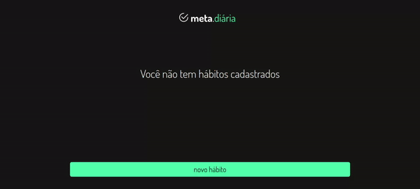

<h1 align="center">Gerenciador de Hábitos</h1>

<h2 align="center">
O Gerenciador de Hábitos é uma aplicação web projetada para ajudar os usuários a monitorar e manter seus hábitos diários de forma organizada e intuitiva. Com uma interface simples e funcionalidades bem definidas, o aplicativo oferece uma plataforma eficaz para acompanhar o progresso e promover o desenvolvimento de hábitos saudáveis.
</h2>

<h3 align="center"> Este projeto foi desenvolvido com base em uma ideia encontrada em 
     <a target="_blank" href="https://codante.io/mini-projetos/gerenciador-de-habitos-com-nextjs">codante</a>. 
</h3>

<h3 align="center">
     <a target="_blank" href="https://gerenciador-habitos-vert.vercel.app/">Testar Projeto</a>
</h3>

<h2>🎨 Demonstração</h2>

    

<h2>🛠 Conhecimentos Utilizados</h2>

- Next JS
- TypeScript
- Tailwind CSS
- Vercel KV
- Redis

<h2>📫 Feedback</h2>

<h3 align="center">
     Se você tiver algum feedback, posso ser encontrado em:
</h3>

   
    

